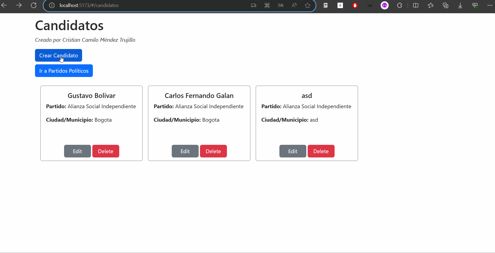

# Prueba Técnica - Elecciones Electorales

Prueba técnica tecnólogo Elecciones Electorales - OAS Universidad Distrital.

Stack Tecnológico utilizado:

- **Back-end:** TypeScript, NestJS, Express.js, TypeORM & PostgreSQL
- **Front-end:** JavaScript & React

**Realizado por:** _Cristian Camilo Méndez Trujillo_

## Instrucciones de Ejecución

## Creación - Base de datos

```bash
# El nombre de la base de datos es:
eleccionesregionales
```

## Instalación - Back

```bash
$ yarn install
```

## Correr Back

```bash
# development
$ yarn run start

# watch mode
$ yarn run start:dev

# production mode
$ yarn run start:prod
```

## Instalación - Front

```bash
$ npm install
```

## Correr Front

```bash
# development
$ npm run dev
```

## Instrucciones de peticiones a la API

El CRUD para Partidos políticos, Candidatos y Votos se realizó en su totalidad:<br />

- Peticiones para **Partidos Políticos**:

1. **Post - Inserción de nuevo partido político**:
   Utilizamos el metodo Post para crear un nuevo partido político.
   
2. **Get - Obtener todos los partidos**:
   Utilizamos el método Get para listar todos los partidos políticos en la base de datos.
   
3. **Patch - Editar un partido**: Utilizamos el método Patch para editar un partido político.
   
4. **Delete - Eliminar un partido**: Utilizamos el método delete para eliminar un partido político.
   

- Peticiones para **Candidatos**:

1. **Post - Inserción de nuevo candidato**:
   Utilizamos el metodo Post para crear un nuevo candidato.
   
2. **Get - Obtener todos los candidatos**:
   Utilizamos el método Get para listar todos los candidatos en la base de datos.
   
3. **Patch - Editar un candidato**: Utilizamos el método Patch para editar un candidato.
   
4. **Delete - Eliminar un candidato**: Utilizamos el método delete para eliminar un candidato.
   

- Peticiones para **Votos**:

1. **Post - Inserción de nuevo voto**:
   Utilizamos el metodo Post para crear un nuevo voto.
   
2. **Get - Obtener todos los votos**:
   Utilizamos el método Get para listar todos los votos en la base de datos.
   
3. **Patch - Editar un voto**: Utilizamos el método Patch para editar un voto.
   
4. **Delete - Eliminar un voto**: Utilizamos el método delete para eliminar un voto.
   

- **Estructura empleada**: La estructura empleada en el proyecto fue MVC, desde backend dividido por módulos, en donde cada módulo tiene su propia entidad, controlador (para manejar peticiones HTTP) y servicios de cada módulo. Para el frontend, se creó un apartado de vistas donde se manejan todas las vistas mostradas anteriormente.

- **Modelo Relacional**:
  El modelo relacional utilizado para este proyecto es:
  
  La persistencia se garantizó mediante una BD SQL hecha en PostgreSQL.

### Notas Finales

**Adicionales Realizados:**

- Se realizó el Frontend del proyecto en React.
- Se documentó la API con Swagger en su totalidad:
  
- No me fue posible desplegar el proyecto por cuestiones de tiempo.

¡Gracias!
